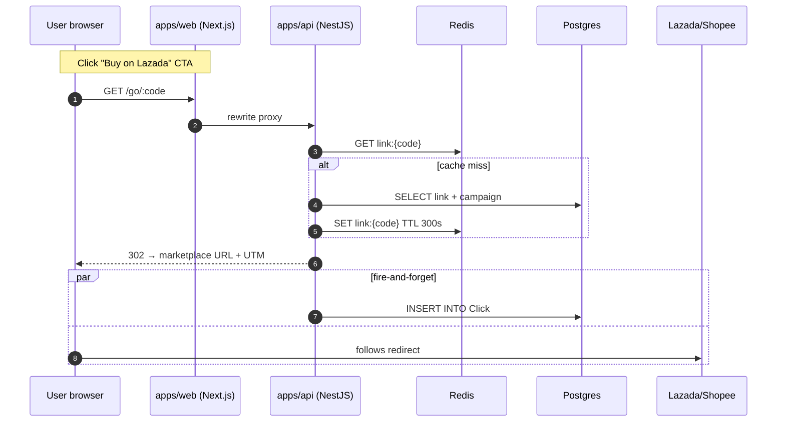

# Jenosize Affiliate Platform

> **Test Assignment — Software Engineer (Lead Engineer) · Jenosize**
>
> Affiliate web app that compares prices between **Lazada** and **Shopee**, generates trackable affiliate short links per campaign, and shows click analytics on an admin dashboard.

## Demo

- **Web (public + admin)**: https://jenosizeweb-production.up.railway.app
- **API**: https://jenosizeapi-production.up.railway.app
- **Swagger / OpenAPI**: https://jenosizeapi-production.up.railway.app/api/docs
- **Health**: https://jenosizeapi-production.up.railway.app/health
- **Admin login** (`/admin/login`): `admin@jenosize.test` / `ChangeMe!2025` (override via env in production)
- **Sample campaign**: _Summer Deal 2025_
- **Test product flow**: Matcha Powder · Yoga Mat · Wireless Earbuds — Lazada vs Shopee

> The admin user is auto-seeded on first boot from `ADMIN_EMAIL` /
> `ADMIN_PASSWORD`. Sample products + campaign + links can be added via
> the admin UI (quick-sample buttons on `/admin/products`) or by running
> `pnpm db:seed` against the production database.

---

## Architecture

```
┌─────────────────────────┐         ┌─────────────────────────┐
│  apps/web (Next.js 14)  │  HTTP   │  apps/api  (NestJS 10)  │
│                         │ ─────►  │                         │
│  • Public landing       │         │  • REST + Swagger       │
│  • Admin dashboard      │         │  • JWT auth (bcrypt)    │
│  • /api/* proxy routes  │         │  • Cron: price refresh  │
│    (forward auth cookie)│         │  • /go/:code redirect   │
└──────────┬──────────────┘         └────┬────────────┬───────┘
           │                             │            │
           │                             ▼            ▼
           │                       ┌──────────┐  ┌─────────┐
           │                       │ Postgres │  │  Redis  │
           │                       │ (Prisma) │  │ (cache) │
           │                       └──────────┘  └─────────┘
           │                             ▲
           │                             │
           ▼                             │
   ┌──────────────────────┐              │
   │ packages/adapters    │  ◄───────────┘
   │ Lazada/Shopee        │  (used by api & jobs)
   │  • parseUrl()        │
   │  • fetchProduct()    │  ← swap mock → real later
   └──────────────────────┘
```



### Why this layout

- **Adapter package boundary** — `packages/adapters` knows nothing about Nest or Prisma. The api swaps mocks → real Affiliate APIs by replacing one file in the registry.
- **Workspace + path aliases** — `@jenosize/shared` keeps Zod schemas + DTO types canonical so api and web cannot drift.
- **Public/admin split via Next middleware** — `/admin/*` routes require an `access_token` cookie; everything else (including `/go/:code`) is public.
- **Web → API auth via web-origin cookie** — the browser hits `/api/login` on the web origin; the route handler forwards to the api and re-issues the cookie on the user-facing domain. This avoids cross-site cookie issues on Railway preview URLs.
- **Redirect on the hot path uses Redis** — link lookup is cached for 5 minutes; click insert is fire-and-forget so it never blocks the 302.

---

## Tech stack & rationale

| Layer | Choice | Why |
|-------|--------|-----|
| Frontend | **Next.js 14** App Router | Server components fetch directly from api; small client bundle; built-in middleware for protected routes |
| Backend | **NestJS 10** | DI + module boundaries make adapters/auth/jobs cleanly separable; first-class Swagger + class-validator |
| ORM / DB | **Prisma + Postgres 16** | Type-safe queries; readable migrations |
| Cache | **Redis** (ioredis) | Sub-ms link lookup; degrades gracefully if unset (in-memory fallback) |
| Auth | **JWT (bcryptjs cost 12) + httpOnly cookie** | Standard, no third-party needed; first-boot seeded admin |
| Validation | **class-validator (api) + Zod (shared)** | Runtime safety on every boundary |
| Charts | **Recharts** | Zero-config bar chart for the dashboard |
| Testing | **Jest + Supertest** | One unit suite per pure helper, one e2e on the redirect |
| CI | **GitHub Actions** with postgres + redis services | Lint, typecheck, unit, e2e, build all run on every PR |
| Hosting | **Railway** (per user's choice) | Web + api + worker in one project; managed Postgres + Redis |

---

## Repository layout

```
apps/
  api/              NestJS — REST API + cron worker
    prisma/         schema + migrations + seed
    src/modules/    auth · products · campaigns · links · redirect · dashboard · jobs · health
    test/           e2e (redirect)
  web/              Next.js 14 — App Router
    src/app/        public pages + /admin/* + /api/* proxy routes
    src/middleware.ts  protects /admin/*
packages/
  adapters/         Marketplace adapters (Lazada/Shopee mocks + JSON fixtures)
  shared/           Zod schemas + DTO types shared by api & web
infra/
  docker-compose.yml  Postgres + Redis for local dev
.github/workflows/ci.yml
```

---

## Local setup

```bash
# 1. Prereqs: Node 20, pnpm 9, Docker
node -v        # v20.x
pnpm -v        # 9.x

# 2. Install
pnpm install

# 3. Start Postgres + Redis
pnpm infra:up
cp .env.example .env

# 4. Apply DB schema + seed sample data
pnpm db:migrate
pnpm db:seed

# 5. Run both api + web
pnpm dev       # api on :3001, web on :3000
```

Open:
- http://localhost:3000 — landing (Active campaigns)
- http://localhost:3000/admin/login — `admin@jenosize.test` / `ChangeMe!2025`
- http://localhost:3001/api/docs — Swagger UI
- http://localhost:3001/health — liveness probe

### Run tests

```bash
pnpm test                          # unit
pnpm --filter @jenosize/api test:e2e   # e2e (needs Postgres up)
```

---

## Data model

```
Product 1───* Offer        (per Marketplace)
Product 1───* Link         ──┐
Campaign 1──* Link         ──┴── Click *───1 Link
```

| Entity | Fields |
|--------|--------|
| `Product` | id, title, imageUrl, createdAt |
| `Offer` | id, productId, marketplace, storeName, price, currency, externalUrl, externalId, lastCheckedAt — unique(productId, marketplace) |
| `Campaign` | id, name, utmSource, utmMedium, utmCampaign, startAt, endAt |
| `Link` | id, productId, campaignId, marketplace, shortCode (unique nanoid 8), targetUrl |
| `Click` | id, linkId, timestamp, referrer, userAgent, ipHash (sha256, salted) |

Best-price flag is computed in `ProductsService.markBestPrice()` — pure function, unit-tested.

---

## API surface

Full schemas live in **Swagger UI** at `/api/docs`. Highlights:

| Method | Path | Auth | Description |
|--------|------|------|-------------|
| POST | `/api/auth/login` | — | Sets httpOnly `access_token` cookie |
| POST | `/api/auth/logout` | — | Clears cookie |
| GET | `/api/auth/me` | JWT | Current user |
| POST | `/api/products` | JWT | Add product from URL/SKU (auto-detects marketplace) |
| GET | `/api/products` | — | List with offers + best-price flag |
| GET | `/api/products/:id/offers` | — | Offers for one product |
| POST | `/api/campaigns` | JWT | Create campaign with UTM |
| GET | `/api/campaigns` | — | List (used by public landing) |
| GET | `/api/campaigns/:id` | — | With linked products + offers |
| POST | `/api/links` | JWT | Generate short link for product · campaign · marketplace |
| GET | `/api/links` | JWT | List links with click counts |
| GET | `/go/:code` | — | **302** redirect to marketplace URL with UTMs appended; logs Click |
| GET | `/api/dashboard` | JWT | Totals + by-marketplace + by-campaign + last 7 days |
| GET | `/api/dashboard/top-products` | JWT | Leaderboard by clicks |

---

## Security notes

- **bcrypt cost 12**, JWT 7-day expiry, httpOnly cookie (sameSite=lax in dev, none in prod over HTTPS)
- All admin write endpoints behind `JwtAuthGuard`
- **Open-redirect prevention** — `/go/:code` only redirects to hosts whose suffix is `lazada.co.th`, `lazada.com`, `shopee.co.th`, or `shopee.com`. Anything else returns 400.
- **Rate limiting** — `@nestjs/throttler` global guard (200 req/min default; 600 req/min on the redirect path)
- **Input validation** — `class-validator` on every body; Zod schemas in `@jenosize/shared` for cross-cutting types
- **IP privacy** — IPs are hashed (sha256 + salt, truncated 32 chars) before storage
- **No secrets in code** — `.env.example` is the source of truth; `JWT_SECRET` and `IP_SALT` must be set in prod

---

## Background job

`PriceRefreshJob` (`src/modules/jobs/price-refresh.job.ts`) runs every 6h and re-fetches every `Offer` through its adapter. Mock adapters apply ±5% drift so the cron's effect is visible.

---

## CI/CD

`.github/workflows/ci.yml` — runs on every push and PR:

1. pnpm install (cached)
2. Prisma generate + migrate deploy (against Postgres service container)
3. `pnpm -r typecheck`
4. `pnpm -r test` (unit, all packages)
5. `pnpm --filter @jenosize/api test:e2e` (redirect e2e against real Postgres + Redis)
6. `pnpm -r build` (api Nest build + web Next build)

No auto-deploy in CI — Railway is wired to `main` directly via its GitHub integration.

---

## Trade-offs taken

- **Mock adapters, not real Lazada/Shopee APIs.** Both require Affiliate Program approval (typically multi-day) and the assignment explicitly allows mocks. The `MarketplaceAdapter` interface is the boundary — replacing the mock with a real client (or a Puppeteer/HTTP scraper) is a single-file change with no impact on the api.
- **Cron lives inside the api process**, not a separate worker service. Simpler to deploy and observe; if the cron load grew, splitting into a dedicated worker (or moving to Bull queues) is straightforward.
- **De-dup products by title.** A real catalog would have a canonical `productId` keyed off SKU/EAN; for the assignment, identical titles across Lazada/Shopee fixtures map to the same `Product` so the comparison view works.
- **No tests on Next.js pages.** The product/redirect/best-price logic is the load-bearing code — that's where tests live. Page rendering is exercised by the build step and manual smoke test.

---

## Future roadmap

- [ ] Real Lazada/Shopee Affiliate API integration (drop in adapter, no other changes)
- [ ] Move click ingestion to a Bull queue (durable, retryable, decouples redirect path from DB)
- [ ] Per-campaign A/B variants (link variant + click attribution)
- [ ] Multi-tenant: `Organization` model on every entity
- [ ] Soft delete (Product, Campaign) + audit log
- [ ] OpenTelemetry tracing on the redirect span
- [ ] Geo + device columns on `Click` (parsed from UA + IP)
- [ ] Admin role separation (viewer vs editor)

---

## Deploy on Railway (quick guide)

1. New project → connect this repo
2. Add **Postgres** plugin → exposes `DATABASE_URL`
3. Add **Redis** plugin → exposes `REDIS_URL`
4. **api** service: source = repo, root = `/`, Dockerfile = `apps/api/Dockerfile`. Set env: `JWT_SECRET`, `ADMIN_EMAIL`, `ADMIN_PASSWORD`, `SHORT_LINK_BASE_URL=<api domain>`, `IP_SALT`. Public domain on.
5. **web** service: source = repo, root = `/`, Dockerfile = `apps/web/Dockerfile`. Env: `NEXT_PUBLIC_API_URL=<api domain>`. Public domain on.
6. Run seed once: `pnpm --filter @jenosize/api db:seed` from a railway shell or via a one-off job.

Verify the public-test flow described in the [smoke checklist](./docs/architecture.md#smoke-test).
